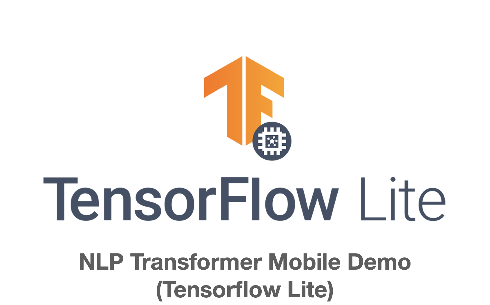
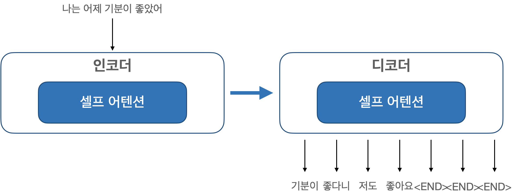

# NLP Smart Reply Mobile Demo based on Transformer Model

<div align="center">
<p>
    
</p>
</div>

## Smart Reply
채팅 메시지를 기반으로 답장 제안을 생성. 수신된 메시지에 쉽게 응답 할 수 있도록 상황에 맞는 응답을 제공하는 모델

## Demo

## Model Structure
- Input 
  - one-hot-vector 형태의 25개 element로 구성된 배열을 입력형태로 받음
- Output
  - 7개의 Output Layer로 구성되어 있으며 각각이 수신된 메시지에 대한 응답 결과의 요소

<div align="center">
<p>
    
</p>
</div>

- one-hot-vector 특정 토큰
  - \<PAD\>: 어떤 의미도 없는 패딩 토큰, (값: 0)
  - \<SOS\>: 시작 토큰, (값: 1)
  - \<END\>: 종료 토큰, (값: 2)
  - \<UNK\>: 사전에 없는 단어를 의미, (값: 3) 

## Dependencies
- iOS
  - TensorFlowLiteSwift 0.0.1-nightly 사용

- PodFile
```
target 'Transformer-Mobile-Demo' do
  use_frameworks!

  pod 'TensorFlowLiteSwift', '~> 0.0.1-nightly'

end
```

## iOS Sample
```
try interpreter.allocateTensors()
            
let encoderInputArray: [Int64] = [92, 80, 36, 82, 87, 0, 0, 0, 0, 0, 0, 0, 0, 0, 0, 0, 0, 0, 0, 0, 0, 0, 0, 0, 0]
let encoderInputData = Data(buffer: UnsafeBufferPointer(start: encoderInputArray, count: encoderInputArray.count))

// Copy the input data to the input Tensor
try interpreter.copy(encoderInputData, toInputAt: 0)

try interpreter.invoke()

outputTensor_0 = try interpreter.output(at: 4)
outputTensor_1 = try interpreter.output(at: 1)
outputTensor_2 = try interpreter.output(at: 5)
outputTensor_3 = try interpreter.output(at: 3)
outputTensor_4 = try interpreter.output(at: 0)
outputTensor_5 = try interpreter.output(at: 2)
outputTensor_6 = try interpreter.output(at: 6)
```